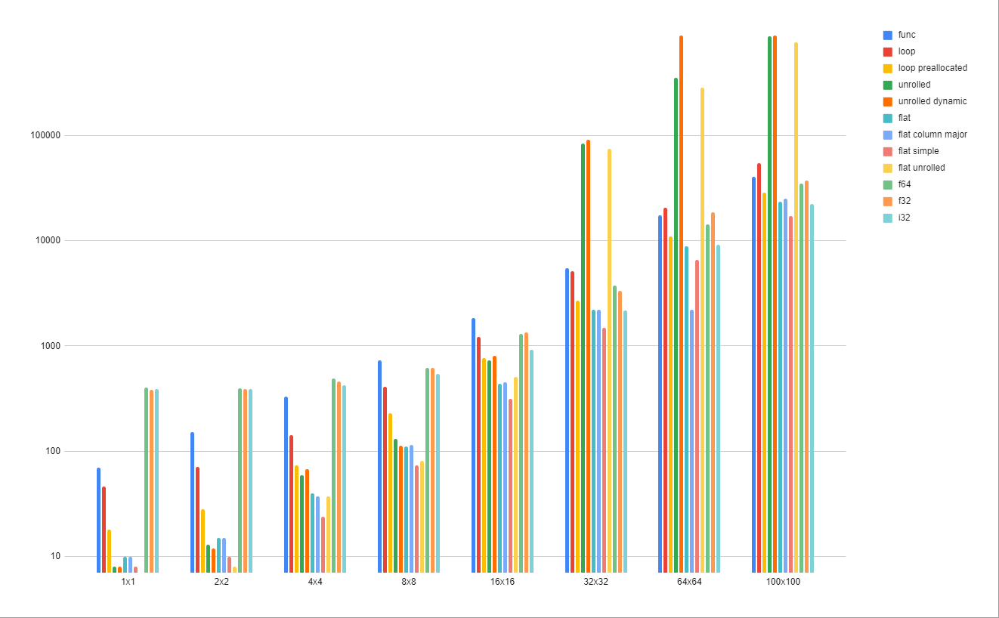

# Fast Matix Math

This is a bench-mark for observing the differences in various matrix-math implementations.

`deno bench` run the bench mark

- `deno task gen-presized-funcs` will create source-code for hard-coded matrix ops
- `deno task gen-rand-data` will generate random test data

Other functions are for outputing bench data in different formats

